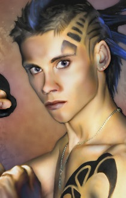

<html>

<b>Kido</b>

<b>NPC mod for BG2EE and EET</b>

Original mod by Deathsangel  
One of the NPCs of the "Mod for the Wicked" series.

- The mod adds the chaotic evil jester, Kido, who receives visions from Cyric.
- A new quest that requires some evil deeds from the party
- New powerful items with the doubtful blessing of Cyric 

  
  

 
&nbsp;

&nbsp;

</body>

</html>

